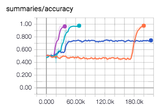

## Marshall rule

### intro
We study, in this project, how neural networks capturing known phyiscal rules.

Currently, we study several parameters and provide their visualization
* Hidden layer size
* Learning rate
* Solver (SGD, ADAM)
* Loss function (cross entropy, hinge loss)




Two kind of datasets
* Configurations
    * sign label
    * even/ odd label
* Coefficients

### usage

Run 
```
python train.py
```

Show results
```
tensorboard --logdir=logs
```
